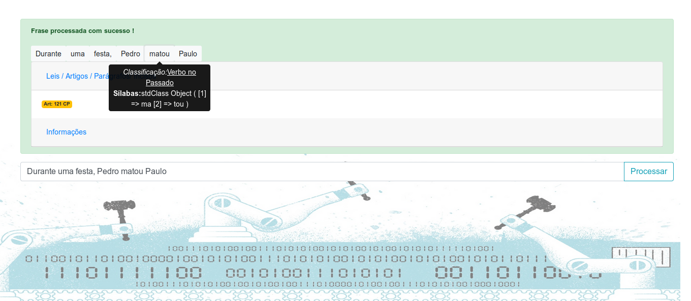
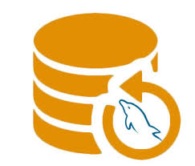

 

# defender-of-the-organization
Game with c and Allegro
 
<table>
	<tr>
		</td colspan="2">Tecnologias Utilizadas</td>
	</tr>
	<tr>
		</td>
			
		</td>
		</td>
			<b>PHP:</b> version 7.2, Regex e cUrl. 
			<a href="https://www.php.net/manual/en/function.preg-match.php" target="_blank">Documentation</a>
		</td>
	</tr>
	<tr>
		</td>
			
		</td>
		</td>
			<b>MySQL</b> 
			<a href="https://dev.mysql.com/doc/" target="_blank">Documentation</a>
		</td>
	</tr>
</table>
 
Para habilitar o modo debug, basta adicionar a variável debug como TRUE em sua url: 
<code><URL>/?debug=true</code>
 

<b>Autores:</b>
<table>
	<tr>
		<td>
			
		</td>
		<td>Alexander Vianna</td>
		<td>
			<b>Github:</b>https://github.com/aavianna
		</td>
		<td>
			<b>Skills:</b> CSS, LESS, SAS, JavaScript, HTML, TypeScript, Backbone
		</td>
	</tr>
	<tr>
		<td>
			
		</td>
		<td>
			
Matheus Soares

		</td>
		<td>
			<b>Email:</b>matheussoares.job@gmail.com
			 
			<b>GitHub:</b>https://github.com/soaresmat
		</td>
		<td>
			<b>Skills:</b> ASP, ASP Core, Regex, AI e Machine Learning
		</td>
	</tr>
	<tr>
		<td>
			
		</td>
		<td>
			
Victor Luis Santos

		</td>
		<td>
			<b>Email:</b>victorluissantos@live.com
			 
			<b>GitHub:</b>https://github.com/victorluissantos
			 
			<b>Stackoverflow:</b>https://stackoverflow.com/users/3712534/santos-l-victor
		</td>
		<td>
			<b>Skills:</b> Java, PHP, MySQL e BigData Laws
		</td>
	</tr>
</bale>